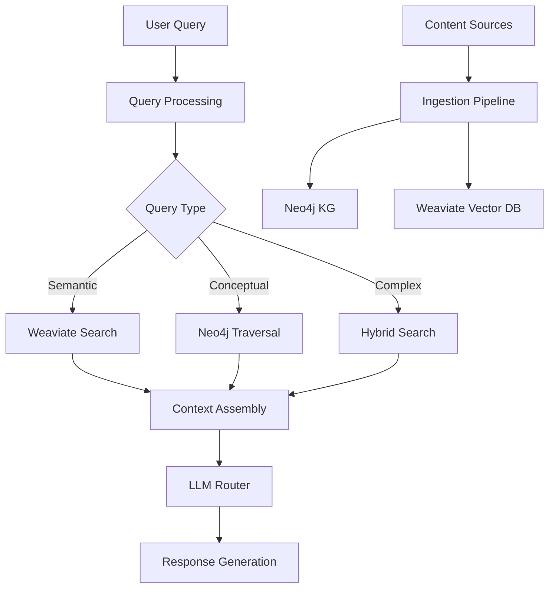

# Graph RAG Pipeline

This document describes the Graph-enhanced Retrieval Augmented Generation (GraphRAG) system that combines Neo4j knowledge graphs with Weaviate vector search for educational content retrieval.

## Overview

GraphRAG enhances traditional RAG by:
- Combining semantic search with knowledge graph relationships
- Providing structured knowledge paths for learning
- Maintaining concept relationships and prerequisites
- Supporting progressive content ingestion
- Enabling personalized learning recommendations

## Architecture Overview



## Content Ingestion Pipeline

### Phase 1: Document Processing

```python
class DocumentProcessor:
    """Process educational documents for graph ingestion"""
    
    def __init__(self):
        self.ocr_engine = TesseractOCR()
        self.nlp_pipeline = ArabicNLPPipeline()
        self.concept_extractor = ConceptExtractor()
    
    def process_textbook(self, pdf_path: str, metadata: dict) -> ProcessedDocument:
        """Convert PDF textbook to structured data"""
        
        # Step 1: OCR Extraction
        pages = self.ocr_engine.extract_pages(pdf_path)
        
        # Step 2: Structure Detection
        chapters = self.detect_chapter_structure(pages)
        
        # Step 3: Content Extraction
        processed_chapters = []
        for chapter in chapters:
            concepts = self.extract_concepts(chapter.content)
            exercises = self.extract_exercises(chapter.content)
            
            processed_chapters.append(ProcessedChapter(
                title=chapter.title,
                content=chapter.content,
                concepts=concepts,
                exercises=exercises,
                metadata=metadata
            ))
        
        return ProcessedDocument(
            title=metadata['title'],
            chapters=processed_chapters,
            metadata=metadata
        )
    
    def extract_concepts(self, text: str) -> List[Concept]:
        """Extract educational concepts from text"""
        
        # Arabic concept extraction
        if self.is_arabic_text(text):
            concepts = self.nlp_pipeline.extract_arabic_concepts(text)
        else:
            concepts = self.nlp_pipeline.extract_english_concepts(text)
        
        # Validate and enrich concepts
        validated_concepts = []
        for concept in concepts:
            if self.validate_concept(concept):
                enriched = self.enrich_concept_metadata(concept)
                validated_concepts.append(enriched)
        
        return validated_concepts
```

### Phase 2: Knowledge Graph Population

```python
class KnowledgeGraphBuilder:
    """Build Neo4j knowledge graph from processed documents"""
    
    def __init__(self, neo4j_driver):
        self.driver = neo4j_driver
        self.relationship_detector = RelationshipDetector()
    
    def ingest_document(self, doc: ProcessedDocument):
        """Ingest processed document into Neo4j"""
        
        with self.driver.session() as session:
            # Create textbook node
            textbook_id = self.create_textbook_node(session, doc)
            
            # Process each chapter
            for chapter in doc.chapters:
                chapter_id = self.create_chapter_node(session, chapter, textbook_id)
                
                # Create concept nodes
                for concept in chapter.concepts:
                    concept_id = self.create_concept_node(session, concept, chapter_id)
                    
                    # Detect and create relationships
                    self.create_concept_relationships(session, concept, concept_id)
    
    def create_concept_relationships(self, session, concept: Concept, concept_id: str):
        """Create relationships between concepts"""
        
        # Find prerequisites
        prerequisites = self.relationship_detector.find_prerequisites(concept)
        for prereq in prerequisites:
            session.run("""
                MATCH (prereq:Concept {name: $prereq_name})
                MATCH (target:Concept {id: $concept_id})
                CREATE (prereq)-[:PREREQUISITE]->(target)
            """, prereq_name=prereq.name, concept_id=concept_id)
        
        # Find related concepts
        related = self.relationship_detector.find_related_concepts(concept)
        for related_concept in related:
            session.run("""
                MATCH (c1:Concept {id: $concept_id})
                MATCH (c2:Concept {name: $related_name})
                CREATE (c1)-[:RELATED_TO {strength: $strength}]->(c2)
            """, concept_id=concept_id, related_name=related_concept.name, 
                 strength=related_concept.strength)
```

### Phase 3: Vector Database Population

```python
class VectorIngestionPipeline:
    """Ingest content into Weaviate vector database"""
    
    def __init__(self, weaviate_client):
        self.client = weaviate_client
        self.chunker = TextChunker()
        self.embedder = MultilingualEmbedder()
    
    def ingest_textbook_content(self, doc: ProcessedDocument):
        """Chunk and vectorize textbook content"""
        
        with self.client.batch as batch:
            for chapter in doc.chapters:
                # Chunk chapter content
                chunks = self.chunker.chunk_text(
                    text=chapter.content,
                    chunk_size=512,
                    overlap=64
                )
                
                for i, chunk in enumerate(chunks):
                    # Detect language and normalize
                    language = self.detect_language(chunk.text)
                    normalized_text = self.normalize_text(chunk.text, language)
                    
                    # Create vector database object
                    obj = {
                        "content": normalized_text,
                        "content_ar": chunk.text if language == 'ar' else "",
                        "subject": chapter.metadata.get('subject'),
                        "grade": chapter.metadata.get('grade'),
                        "chapter_id": chapter.id,
                        "concept_ids": [c.id for c in chunk.related_concepts],
                        "chunk_index": i,
                        "chunk_type": chunk.type,
                        "difficulty": self.estimate_difficulty(chunk.text),
                        "language": language
                    }
                    
                    batch.add_data_object(obj, "TextChunk")
```

## Query Processing Engine

### Hybrid Search Implementation

```python
class GraphRAGSearchEngine:
    """Hybrid search combining vector and graph databases"""
    
