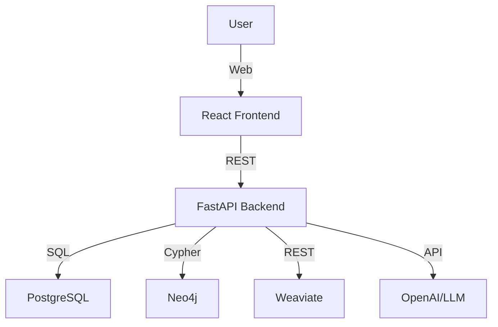

# POC Technical Architecture

## Overview
This document describes the technical architecture for the Egypt Edututor POC.

## Components
- **Backend**: FastAPI (Python)
- **Frontend**: React (TypeScript)
- **Databases**: PostgreSQL, Neo4j, Weaviate
- **LLM**: OpenAI, local models

## Architecture Diagram

## Data Flow
1. User interacts with frontend
2. Frontend sends requests to backend
3. Backend queries DBs and LLM
4. Backend returns results to frontend

## See Also
- [POC Scope](scope.md)

